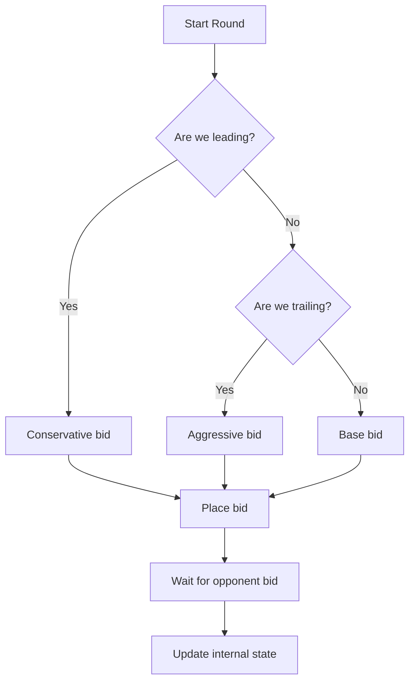
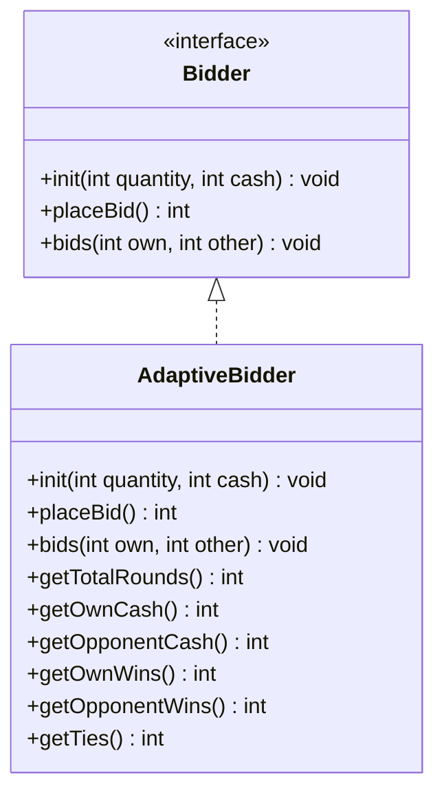

# AdaptiveBidder: A Java Trading Bot for Sequential Auctions

[](https://sonarcloud.io/summary/new_code?id=victorjbassey_trading-bot)
[](https://sonarcloud.io/summary/new_code?id=victorjbassey_trading-bot)
[](https://sonarcloud.io/summary/new_code?id=victorjbassey_trading-bot)
[](https://sonarcloud.io/summary/new_code?id=victorjbassey_trading-bot)

## Overview

This project implements an adaptive trading bot for a sequential auction game. The bot participates in auctions of 2-unit product batches, aiming to maximize the number of units it wins over the course of the game while conserving as much of its monetary units (MU) as possible.
This implementation adheres to the `Bidder` specification and is designed to be used in Java-based auction simulations. The bot employs a dynamic bidding strategy that adapts to the current game state, opponent behavior, and remaining resources.

## Auction Rules Summary

- A product of `x` quantity units is auctioned in `x/2` rounds (2 units per round).
- Both players begin with the same amount of money (`y` MU).
- In each round, both players simultaneously place a bid.
  - The higher bidder wins both units.
  - In case of a tie, each bidder gets 1 unit.
  - Both players pay their bid regardless of outcome.
- Bidding continues until all units are allocated.
- The player who wins more units is the winner. If units are equal, the one with more cash remaining wins.

## Strategy

The strategy used in this implementation is **adaptive** and focuses on **maintaining an advantage** by carefully balancing aggressiveness and cash conservation.

### Key Strategy Components

- **State-aware Bidding**: Tracks remaining cash, rounds, win deficit
- **Dynamic Aggression**: Adapts its bid size based on the current score deficit or surplus (number of rounds won). If behind, the bot bids more aggressively to catch up. If ahead, it minimizes spending to maintain the lead:
  - 🟢 **Leading position**: Minimal sufficient bids
  - 🔴 **Trailing position**: Deficit-based aggression
  - 🎯 **Final rounds**: All-in bidding when critical
- **Resource Conservation**: It computes a base bid as the average available MU per remaining round.
- **Opponent Modeling**: The opponent’s remaining cash is estimated by subtracting the cumulative known bids.

### Implementation Highlights

- Fully implements the `Bidder` interface (`init`, `placeBid`, and `bids` methods).
- Input validation ensures proper game setup.
- Maintains internal state: remaining cash, number of wins, ties, and opponent cash.
- Provides additional helper methods (getters) for testing.

### Adaptive Bidding Algorithm Overview



## Project Structure

```
src/
├── main/
│   └── java/
│       └── de/
│           └── optimax/
│               └── auction/
│                   ├── AdaptiveBidder.java     # The main bidding agent implementation
│                   └── Bidder.java             # Provided interface (from the assignment)
└── test/
    └── java/
        └── de/
            └── optimax/
                └── auction/
                    └── AdaptiveBidderTest.java # Unit tests for AdaptiveBidder
```
- **`AdaptiveBidder.java`**: Implements a dynamic, adaptive bidding strategy.
- **`AdaptiveBidderTest.java`**: Contains unit tests verifying bidding logic, state tracking, and edge-case handling.

### Class Diagram




## Getting Started

### Tooling Summary

| Tool                  | Purpose                             |
|------------------------|-------------------------------------|
| **Java 21+**            | Programming language               |
| **Maven**               | Build & dependency management      |
| **JUnit**               | Unit testing framework             |
| **Spotless**            | Code formatting                    |
| **google-java-format** | Java code style enforcement        |
| **JaCoCo**              | Test coverage reports              |
| **SonarCloud**          | Static code analysis               |
| **GitHub Actions**      | Continuous Integration (CI)        |

### Setup
```bash
  git clone https://github.com/yourusername/trading-bot-auction.git
  cd trading-bot-auction
  ./mvnw clean verify # Compiles and run tests
```

### Usage

This project is designed to be used within an auction simulation framework that instantiates and interacts with bidders through the `Bidder` interface.

```
    Bidder bidder = new AdaptiveBidder();
    bidder.init(quantity, cash);
    
    int myBid = bidder.placeBid();
    bidder.bids(myBid, opponentBid);
```
Repeat the calls to `placeBid` and `bids` in a loop until the auction ends. Below is an example of how to use the `AdaptiveBidder` in a simple auction simulation:

```java
import de.optimax.auction.AdaptiveBidder;
import de.optimax.auction.Bidder;

public class AuctionSimulation {
    public static void main(String[] args) {
        Bidder bot1 = new AdaptiveBidder();
        Bidder bot2 = new AdaptiveBidder(); // or another implementation of Bidder

        bot1.init(20, 100); // 20 QU, 100 MU
        bot2.init(20, 100);

        for (int i = 0; i < 10; i++) { // 10 rounds (20 units)
            int bid1 = bot1.placeBid();
            int bid2 = bot2.placeBid();

            bot1.bids(bid1, bid2);
            bot2.bids(bid2, bid1);
        }
    }
}
```

## Quality Assurance

### Running Tests

This project includes unit tests for validating the bidding strategy logic, state tracking, and edge-case handling. To execute tests:
```bash
./mvnw test
```

### ✅ Test Coverage
Test coverage is tracked using **JaCoCo**. To generate a coverage report (after running tests):
```bash
./mvnw jacoco:report
```
The coverage report can be found in `target/site/jacoco/index.html`. You can open this HTML file in your browser to view detailed coverage metrics.

### 🧹 Code Formatting (Spotless)
This project uses **[Spotless](https://github.com/diffplug/spotless)** with **[google-java-format](https://github.com/google/google-java-format)** to enforce consistent and opinionated Java formatting, following Google’s official Java style guide. 
To automatically format the code:
```bash
./mvnw spotless:apply
```
To check formatting violations without applying changes:
```bash
./mvnw spotless:check
```

### 📊 Static Analysis (SonarQube Cloud)
This project is integrated with SonarCloud for continuous code quality analysis. You can view the project's quality gate status, coverage, and vulnerabilities on [the SonarCloud dashboard](https://sonarcloud.io/summary/overall?id=victorjbassey_trading-bot&branch=main).

---

## 📘 Additional Documentation

- [Post-Mortem Report](./POSTMORTEM.md): Reflections, trade-offs, and future improvement ideas.